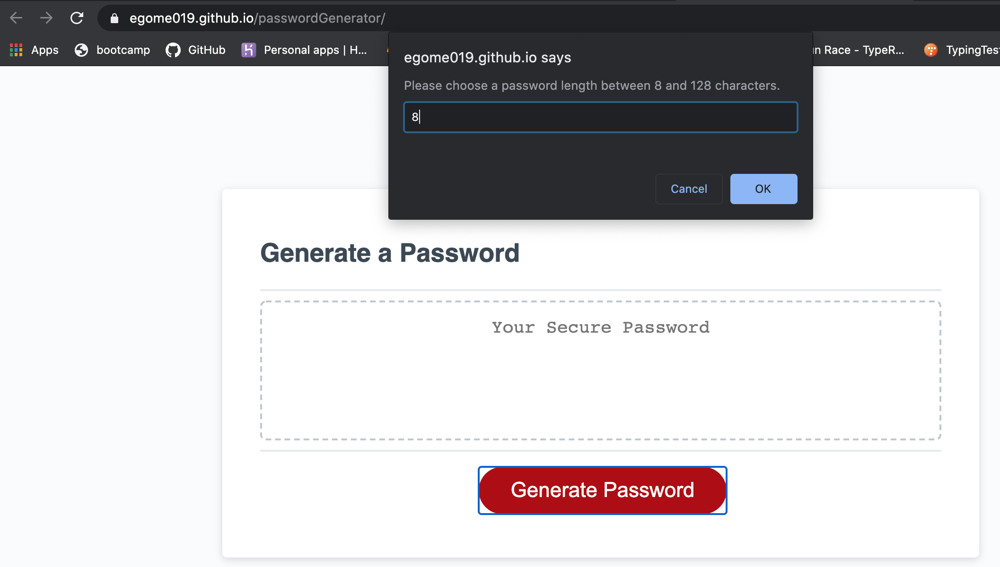

# passwordGenerator

Created an application that generates a password between 8 and 128 characters. When the user clicks the generate password button, they are prompted for a password length, then the user is prompted to pick the kind of characters they want to include in the password. They can choose between Upper Case letters, Lower Case letters, Numbers, and Special Characters. Once the user picks the characters, the application will generate a password to the specification they chose.

Here is a link to the application: https://egome019.github.io/passwordGenerator/

Screenshot of the first prompt that determines password length

Then screenshots of each character set that the user wants

Then the screenshot below is the final product

